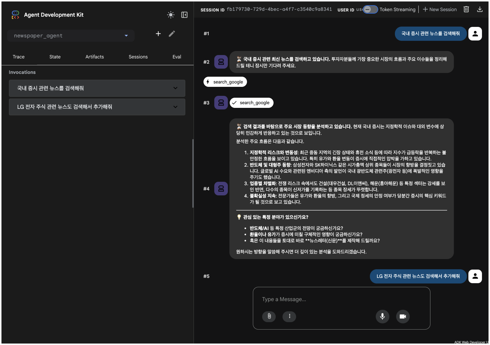
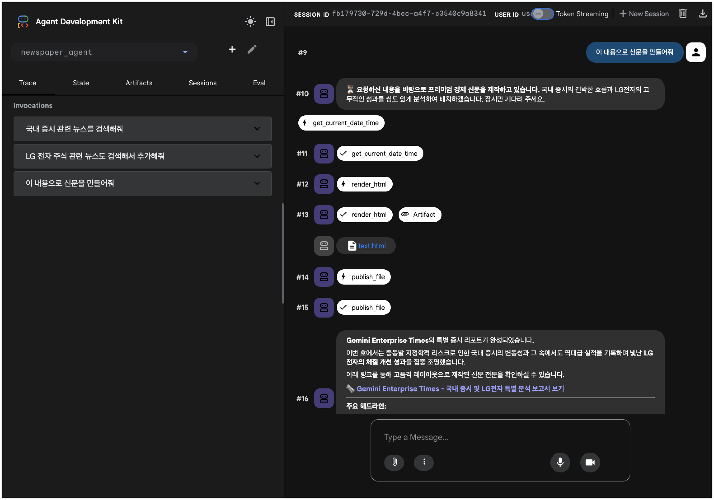
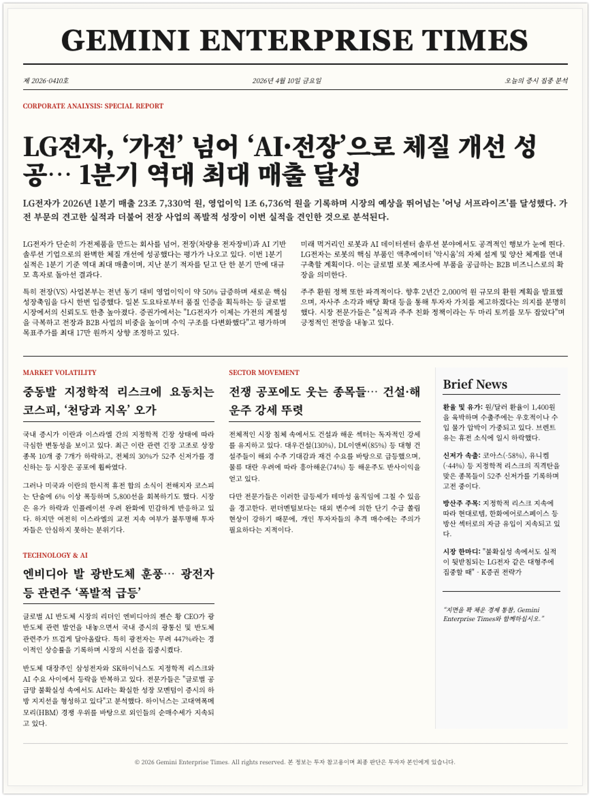

# Newspaper Agent (Gemini Enterprise Times Generator)

The Newspaper Agent is a Gemini-powered assistant designed to act as an "Attention Guardian". It provides high-density knowledge briefings and generates premium, text-focused newspapers ("Gemini Enterprise Times") based on user consultation and search grounding.

## Overview

This agent assists users in digesting large amounts of information from the web. It serves as a comprehensive demonstration of:

1.  **Consultative Dialogue:** The agent does not just dump data. It engages in an iterative consultation with the user to refine topics before generating the final report.
2.  **High-Density Knowledge:** Extracts absolute truth and consensus from diverse web sources using Gemini Search Grounding.
3.  **Premium HTML Layout:** Generates a highly aesthetic, classic newspaper layout using a custom CSS grid (Top Story, Sidebar, multi-column).
4.  **No-Chart Policy:** Focuses purely on high-quality text layout and editorial workflow, avoiding generic charts.


### Component Details

*   **Agent:** `newspaper_agent` (Root)
*   **Skills:** `daily-briefing` (Modular workflow for location-based events)
*   **Tools:**
    *   `search_google`: Gemini-powered search grounding with 429 retry logic.
    *   `get_current_date_time`: Returns current UTC time.
    *   `get_date_range`: Calculates date ranges for search.
    *   `render_html`: Saves HTML content to a file.
    *   `publish_file`: Publishes content to a public URL (GCS).
    *   `skill_toolset`: Manages modular skills.

## Screenshots





## Setup and Installation

### Folder Structure
```
newspaper-agent/
├── README.md                 # Documentation
├── pyproject.toml            # Dependencies and configuration
├── .env                      # Environment variables
└── newspaper_agent/          # Main Package
    ├── agent.py              # Main Agent logic
    ├── config.py             # Configuration loader
    ├── tools.py              # Custom tools
    ├── prompts/              # System instructions
    │   └── newspaper_agent.txt
    └── skills/               # Modular skills
        └── daily-briefing/
```

### Prerequisites

- Python 3.10+
- [uv](https://github.com/astral-sh/uv) (for dependency management)
- Google Cloud Project (with Vertex AI enabled)
- Google Cloud Storage Bucket (for publishing files)

### Installation

1.  **Navigate to the agent directory:**
    ```bash
    cd newspaper-agent
    ```

2.  **Install dependencies:**
    ```bash
    uv sync
    ```

3.  **Configure Environment:**
    Create a `.env` file in the root directory:
    ```bash
    GOOGLE_CLOUD_PROJECT=your-project-id
    GOOGLE_CLOUD_LOCATION=us-central1
    GOOGLE_GENAI_USE_VERTEXAI=1
    PUBLIC_ARTIFACT_BUCKET=your-public-bucket-name
    ```

> [!IMPORTANT]
> **Public Storage Bucket Configuration:**
> To use the newspaper publishing feature (`publish_file` tool), you must create a Google Cloud Storage bucket and set its name in the `.env` file as shown above. The `config.py` file loads this value to determine where to upload the generated HTML files. Make sure the bucket is configured for public access if you want shareable links to be viewable by others.

## Usage

### Running in CLI
Interact with the agent directly in your terminal:
```bash
uv run adk run newspaper_agent
```

### Running with Web UI
```bash
uv run adk web
```
*Select `newspaper_agent` from the dropdown menu.*

### Deploying to Agent Engine
```bash
adk deploy agent_engine \
        --project=$PROJECT_ID \
        --region=us-central1 \
        --display_name="newspaper_agent" \
        newspaper_agent
```

## Workflow

1.  **Consultation:** Discuss topics with the agent. It will search and propose content.
2.  **Trigger:** Ask the agent to generate the newspaper (e.g., "신문으로 만들어줘" or "최종 신문 생성해줘").
3.  **Output:** The agent renders an HTML file (in Korean by default) and provides a public URL link.


